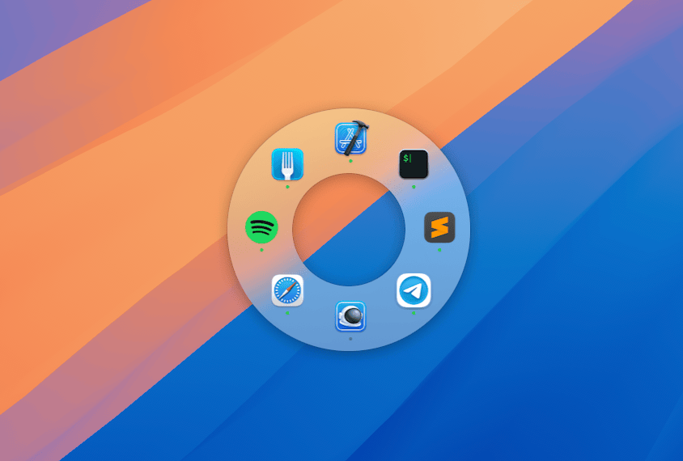

# 🔘 Launchy - App Launcher Switcher

A macOS app that provides quick access to launch or switch between applications through a radial menu interface.

## Description
Launchy is a productivity tool that enhances your application launching and switching workflow on macOS. It rovides a customizable radial menu to quickly access, launch, and manage your applications.

> [!NOTE]  
> ⬇️ [Download](https://apps.apple.com/de/app/launchy-app-launcher-switcher/id6739782043?l=en-GB&mt=12) from the Mac App Store.

> [!IMPORTANT]  
> Join the [Discord](https://discord.gg/RazjXZKEap) server

## Features

### Application Management
- Custom app selection and configuration
- Support for both user-defined apps and running apps modes
- Ability to import/export app configurations

### Radial Menu Interface
- Circular app launcher with customizable appearance
- Visual indicators for running applications
- App name display options
- Drag and drop support for adding applications or rearranging them
- Keyboard shortcuts for navigation
- Selecting apps by pressing A...Z keys

### Application Control
- Launch applications
- Switch between running applications
- Hide/Unhide applications
- Support for launch arguments and advanced app configurations

### System Integration
- Menu bar integration with optional icon visibility
- Launch at login capability
- iCloud sync support for settings
- Sandboxed application for security
- Support for macOS 13.0 and later

### Customization Options
- Advanced app configuration options
  - Hide other apps when launching
  - Auto-hide after launch
  - Activate all windows option
  - Custom launch arguments
- Visual customization for the radial menu
- Mode switching between user-defined and running apps

### Accessibility
- Keyboard navigation support
- Visual indicators for hidden apps
- Running app status indicators
- Support for drag and drop file opening

## Changelog
### Version 1.2 (15.01.2025)
- Improved performance of the menu appearance—now, without animation, it appears instantly.
- The maximum selection tolerance has been increased.
- The maximum possible menu size has been increased.
- The maximum possible thickness has been increased.
- Enhanced app selection—you can now choose an app from the list of running applications.
- Improved handling of long app names.
- Switching between apps is now faster.
- Various memory issues fixed—the memory footprint has been reduced.
- While switching between spaces, the menu no longer sticks to any of them.
- Keyboard layouts supported: QWERTY, QWERTZ, Dvorak, and more.
- Fixed onboarding keypresses not being properly handled when the window was closed.
- Switching to a miniaturized app now restores it properly.

### Version 1.2.1 (15.01.2025)
- Fixed an issue where apps were not saved if selected from the dropdown.
- Improved the handling of hidden apps.

### Version 1.2.2 (16.01.2025)
- Showing an alert explaining how to bring back the Preferences window when using the ‘Hide menu bar icon’ toggle.
- Fixing localization issues

### Version 1.2.3 (21.01.2025)
- Showing app names in the center of the menu
